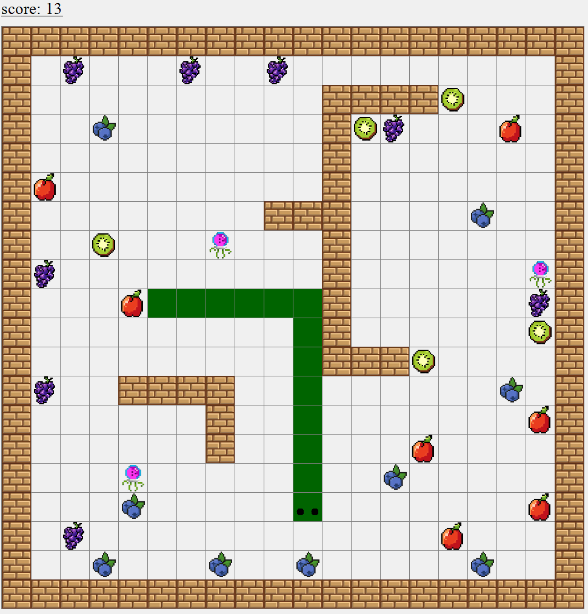
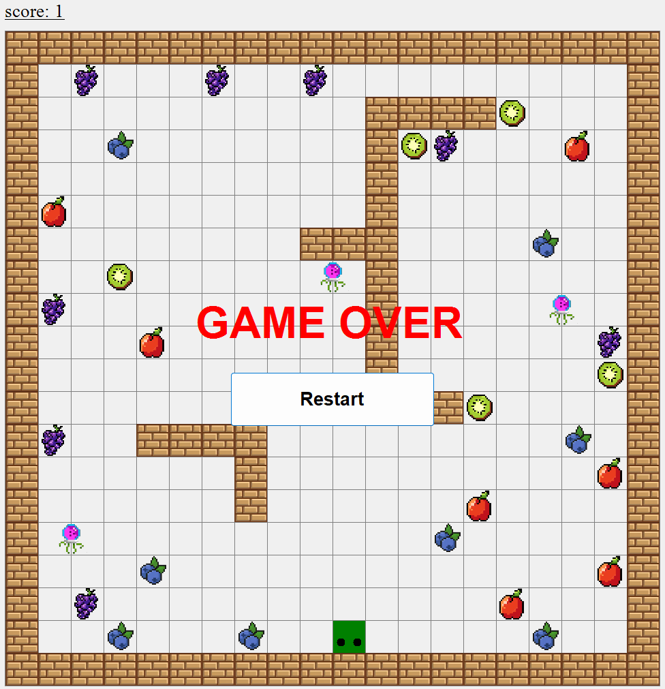

# Snake - Learning Project

This is a simple **Snake** game created as a learning project in C#.  
The game was developed to practice **game logic**, **Windows Forms**, and **object-oriented programming** concepts.

---

## Game Overview

In this game, the player controls a snake that moves around a map, eating fruits to grow.  
The goal is to explore the map, collect fruits, and learn programming concepts through game development.

**Features included:**

- Move the snake using **W, A, S, D** keys  
- Different types of fruits that give **various effects** (e.g., increase score, speed, or length)  
- Basic collision detection (walls, self-collision)  
- Score tracking  
- Simple map with obstacles and boundaries

---

## How to Run

1. Make sure you have **Visual Studio** installed with **.NET Desktop Development** workload.  
2. Clone or download this repository.  
3. Open the solution file in Visual Studio.  
4. Build and run the project (`F5` or `Start` button).  
5. Control the snake using **W (up), A (left), S (down), D (right)**.

---

## Screenshots

